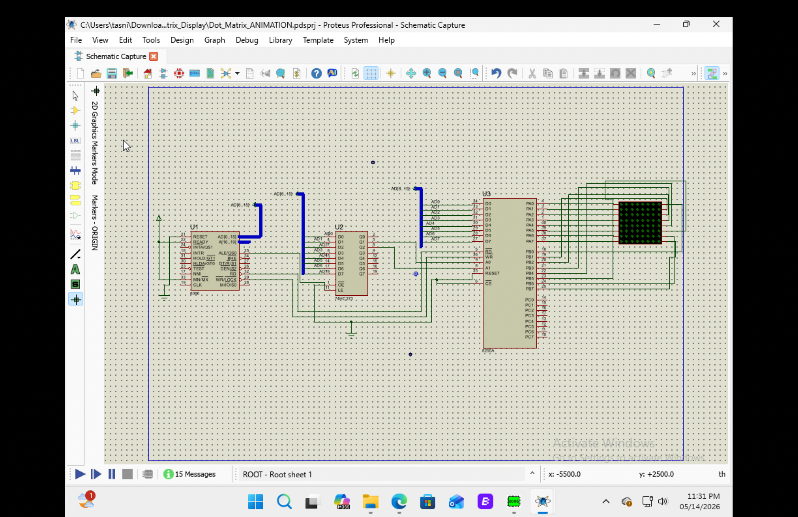

# Dot Matrix Animation Using 8086 Microprocessor

## 📌 Project Overview
This project demonstrates a simple LED Dot Matrix Animation using the 8086 Microprocessor and 8255 Programmable Peripheral Interface (PPI). The animation is created by continuously rotating binary data using Assembly Language instructions.

The project was designed and simulated in Proteus.

---

## 🎯 Objectives
- To interface an 8×8 Dot Matrix Display with 8086.
- To understand 8255 PPI interfacing.
- To create LED animation using Assembly Language.
- To learn low-level hardware control techniques.

---

## 🛠️ Technologies Used
- 8086 Microprocessor
- 8255 PPI
- Assembly Language
- Proteus Simulation

---

## ⚙️ Working Principle
- Port A sends row data to the dot matrix display.
- Port B controls the active columns.
- The `ROL` instruction rotates the binary data stored in register `BL`.
- This rotation creates a moving LED animation effect.
- A delay subroutine controls the animation speed.

---

## 💻 Assembly Code

```asm
CODE SEGMENT
    ASSUME CS:CODE,DS:CODE,ES:CODE,SS:CODE

PPIC_C EQU 06H
PPIC   EQU 04H
PPIB   EQU 02H
PPIA   EQU 00H

ORG 0000H

    MOV AL,10000000B
    OUT PPIC_C,AL
    MOV BL,11111110B

L1:
    MOV AL,11111111B
    OUT PPIA,AL

    MOV AL,BL
    OUT PPIB,AL

    CALL DELAY
    ROL BL,1

    JMP L1

DELAY:
    MOV CX,0FFFFH

TIMER1:
    NOP
    NOP
    NOP
    NOP

    LOOP TIMER1
    RET

CODE ENDS
END
```

---

## 🧠 Code Explanation

| Instruction | Description |
|---|---|
| `OUT PPIA,AL` | Sends data to Port A |
| `OUT PPIB,AL` | Controls columns of dot matrix |
| `ROL BL,1` | Rotates LED pattern |
| `CALL DELAY` | Creates visible animation delay |
| `LOOP TIMER1` | Runs delay loop |

---

## 📷 Circuit Diagram




---

## 🎥 Output
Add animation screenshot/GIF here.

```md

```

---

## 📊 Result
The dot matrix display successfully produced a continuous moving LED animation pattern.

---

## 📚 Learning Outcomes
- Learned 8086 Assembly Programming
- Understood 8255 PPI interfacing
- Gained practical experience with hardware simulation
- Learned LED matrix control techniques

---

## 👨‍💻 Author
SK Tasnim Ur Rahman
